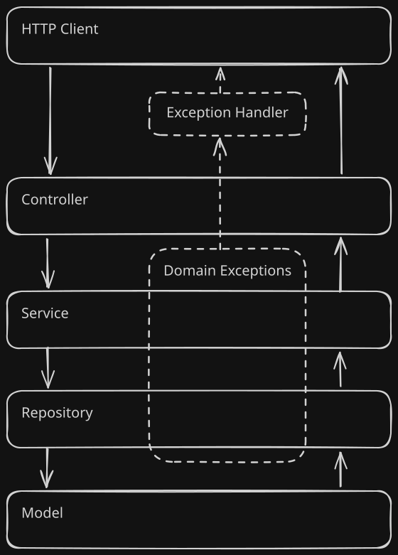
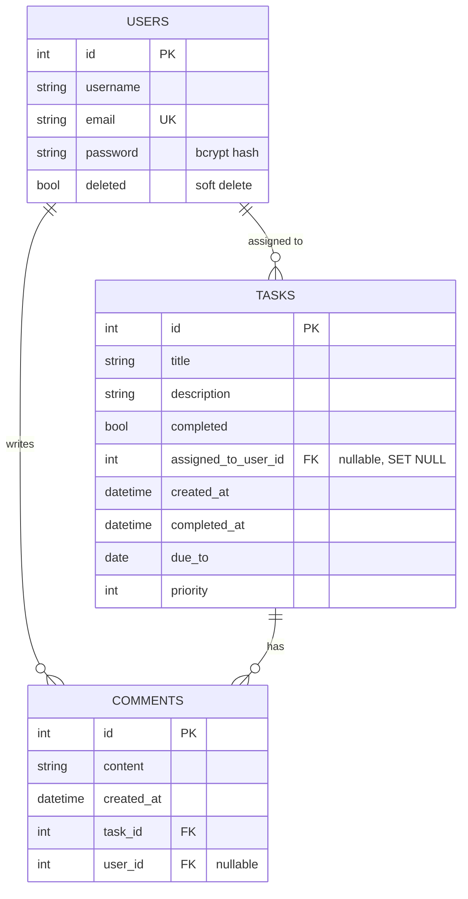

# TodoApi

A self-hosted collaborative task board, exposed as a REST API — a shared workspace of tasks with per-user identity, JWT authentication and threaded comments.


## Highlights

- **Layered architecture with dependency injection.** Every request flows Controller → Service → Repository → Model, and each layer receives the one below it through FastAPI's `Depends()` constructor injection, so swapping the SQLite repository for another backend touches one file per entity.
- **Framework-agnostic error handling.** Services and repositories raise plain domain exceptions (`UserNotFound`, `PermissionDenied`, …); a handler registry translates each into a typed HTTP error at the application edge. No business-logic module imports `fastapi.HTTPException`.
- **Real authentication.** OAuth2 password flow, JWT access tokens signed with HS256 (PyJWT), passwords hashed with bcrypt through passlib.
- **Tested through the HTTP layer.** 31 pytest functions, 19 of them parametrized across several cases each, every one running against a freshly created in-memory SQLite database, pairing a success path with its failure path per endpoint.
- **CI on every push.** GitHub Actions runs the full suite with coverage on every push and pull request to `main`.
- **Containerized.** Dockerfile plus Compose, with the SQLite file persisted on a host volume so data survives rebuilds.

## Architecture



| Layer | Directory | Responsibility |
| --- | --- | --- |
| Controllers | `app/controllers/` | Route definitions, request/response binding, auth dependencies |
| Services | `app/services/` | Business rules and permission checks |
| Repositories | `app/repository/` | Persistence; all SQLAlchemy queries live here |
| Models | `app/models/` | SQLAlchemy 2.0 `DeclarativeBase` entities with `Mapped[]` typing |
| DTOs | `app/dtos/` | Pydantic v2 schemas for every request and response shape |
| Infrastructure | `app/infraestructure/` | Engine and session factory, JWT helpers, password hashing |
| Exceptions | `app/exceptions/` | `domain.py` (pure), `http.py` (typed HTTP errors), `handlers.py` (the bridge) |

### Error translation

`app/exceptions/domain.py` defines exceptions that know nothing about the web: `UserAlreadyExists`, `UserNotFound`, `UserNotActive`, `TaskNotFound`, `CommentNotFound`, `PermissionDenied`. `app/exceptions/handlers.py` registers one FastAPI handler per domain exception, mapping it to its counterpart in `app/exceptions/http.py`:

| Domain exception | HTTP status |
| --- | --- |
| `UserNotFound`, `TaskNotFound`, `CommentNotFound` | 404 |
| Invalid credentials | 401 (`WWW-Authenticate: Bearer`) |
| `UserAlreadyExists` | 409 |
| `UserNotActive`, `PermissionDenied` | 403 |

The payoff: the service layer is testable and portable without a web framework in scope, while HTTP semantics stay in one place.

> `app/models/__init__.py` declares `Base` first and imports the three model modules at the bottom of the file, which is what keeps the mutually-referencing relationships from forming an import cycle.

## Data model



Deleting a task cascades to its comments (`cascade="all, delete-orphan"`). Deleting a user is a *soft* delete, the row stays and `deleted` flips to `true`, so tasks and comments keep their history; assignment on tasks is `ON DELETE SET NULL` for the hard-delete case.

## Authentication and access model

This is a **shared board**, and the permission model follows from that:

- **Tasks are a common workspace.** Any client of the instance can list, create, edit and delete tasks, that is the point of a shared board, and tasks carry an `assigned_to_user_id` rather than an owner.
- **Comments carry authorship.** Posting requires a token so the comment can be attributed; editing and deleting are restricted to the author, enforced in `CommentService` via `PermissionDenied`.
- **Accounts are self-owned.** A user may only update or delete their own account; attempting either on someone else's returns 403.

**Token flow**

1. `POST /api/v1/auth/login` with an OAuth2 password form (`username` = the user's email, `password`).
2. The service loads the credentials by email and verifies the bcrypt hash.
3. On success a JWT is issued with `sub` set to the email and an expiry of `ACCESS_TOKEN_EXPIRE_MINUTES`, returned as `{"access_token": "...", "token_type": "bearer"}`.
4. Protected routes depend on `get_current_user`, which decodes the token and re-loads the user; an invalid, expired or soft-deleted subject yields 401/403.

## API reference

All routes are served under `/api/v1`. Interactive docs are generated at [`/docs`](http://localhost:8080/docs) (Swagger UI) and [`/redoc`](http://localhost:8080/redoc).

### Auth

| Method | Path | Auth | Description |
| --- | --- | :---: | --- |
| `POST` | `/auth/login` | — | Exchange email + password for a bearer token |
| `POST` | `/auth/logout` | — | Placeholder; token invalidation is not implemented yet |

### Users

| Method | Path | Auth | Description |
| --- | --- | :---: | --- |
| `POST` | `/users` | — | Register; the password is hashed before it reaches the repository |
| `GET` | `/users/me` | ✅ | Profile of the authenticated user |
| `GET` | `/users/{user_id}` | — | Fetch a profile; 403 if the account was soft-deleted |
| `PUT` | `/users/{user_id}` | ✅ | Update — own account only |
| `DELETE` | `/users/{user_id}` | ✅ | Soft delete — own account only |

### Tasks

| Method | Path | Auth | Description |
| --- | --- | :---: | --- |
| `POST` | `/tasks` | — | Create a task; validates that `assigned_to_user_id` exists |
| `GET` | `/tasks` | — | List with filtering (see below) |
| `GET` | `/tasks/{task_id}` | — | Fetch one task |
| `PUT` | `/tasks/{task_id}` | — | Full update; stamps `completed_at` when marked complete |
| `PATCH` | `/tasks/{task_id}` | — | Partial update |
| `DELETE` | `/tasks/{task_id}` | — | Delete the task and its comments |

**Filtering `GET /tasks`** — every parameter is optional and they compose:

| Parameter | Effect |
| --- | --- |
| `title` | Case-insensitive substring match |
| `completed` | Filter by completion state |
| `assigned_to_user_id` | Tasks assigned to a given user |
| `created_after` / `created_before` | Creation-timestamp range |
| `completed_after` / `completed_before` | Completion-timestamp range |
| `due_after` / `due_before` | Due-date range |
| `min_priority` / `max_priority` | Priority range |

### Comments

| Method | Path | Auth | Description |
| --- | --- | :---: | --- |
| `POST` | `/comments` | ✅ | Comment on a task, attributed to the caller; 404 if the task is missing |
| `GET` | `/comments?task_id=` | — | Comments of a task |
| `GET` | `/comments/{comment_id}` | — | Fetch one comment |
| `GET` | `/tasks/{task_id}/comments` | — | Nested listing of a task's comments |
| `PUT` | `/comments/{comment_id}` | ✅ | Update, author only |
| `DELETE` | `/comments/{comment_id}` | ✅ | Delete, author only |

## Getting started

### With Docker

```shell
git clone https://github.com/Vini-boat/TodoApi.git
cd TodoApi/
cp .env.example .env
docker compose up --build
```

The API listens on <http://localhost:8080>; the database file is bind-mounted at `./data/app.db`, so it survives `docker compose down`.

### Locally

```shell
git clone https://github.com/Vini-boat/TodoApi.git
cd TodoApi/
py -m venv .venv
.\.venv\Scripts\Activate.ps1
pip install -r requirements.txt
cp .env.example .env
uvicorn app.main:app --reload --port 8080
```

Tables are created on startup through the FastAPI lifespan hook, there is no migration step to run.

### Configuration

A `.env` file must exist **before** the app is imported: `app/config.py` reads the settings at module level and casting the token expiry fails hard when it is missing.

| Variable | Example | Purpose |
| --- | --- | --- |
| `DATABASE_URL` | `sqlite:///data/app.db` | SQLAlchemy connection string |
| `HASH_ALGORITHM` | `bcrypt` | passlib scheme used for passwords |
| `SECRET_KEY` | *64 hex chars* | JWT signing key |
| `JWT_ALGORITHM` | `HS256` | JWT signature algorithm |
| `ACCESS_TOKEN_EXPIRE_MINUTES` | `30` | Access-token lifetime |

`.env.example` ships a placeholder `SECRET_KEY` for convenience. Generate your own before exposing an instance:

```shell
python -c "import secrets; print(secrets.token_hex(32))"
```

## Testing

```shell
pytest --cov=app --cov-report=term-missing
```

Tests drive the application through FastAPI's `TestClient`, so each case exercises routing, validation, the service and repository layers and the exception handlers together. Isolation comes from a single fixture in `tests/conftest.py`: it overrides the database dependency with an in-memory SQLite engine on a `StaticPool`, creates the schema before the test and drops it after, so no test can observe another's rows.

The CI workflow (`.github/workflows/pytest.yml`) runs this exact command on Python 3.12 for every push and pull request targeting `main`, and can also be dispatched manually.

## Roadmap

- OAuth2 scopes to introduce roles (admin / user / guest) on top of the current identity layer
- A real logout: token denylist or refresh-token rotation
- Alembic migrations, replacing create-on-startup
- Unit tests at the service and repository level, `tests/services/` and `tests/repository/` are scaffolded but still empty; coverage today is end-to-end only

## License

[MIT](LICENSE) © 2025 Vinicius de Ávila Bezerra
